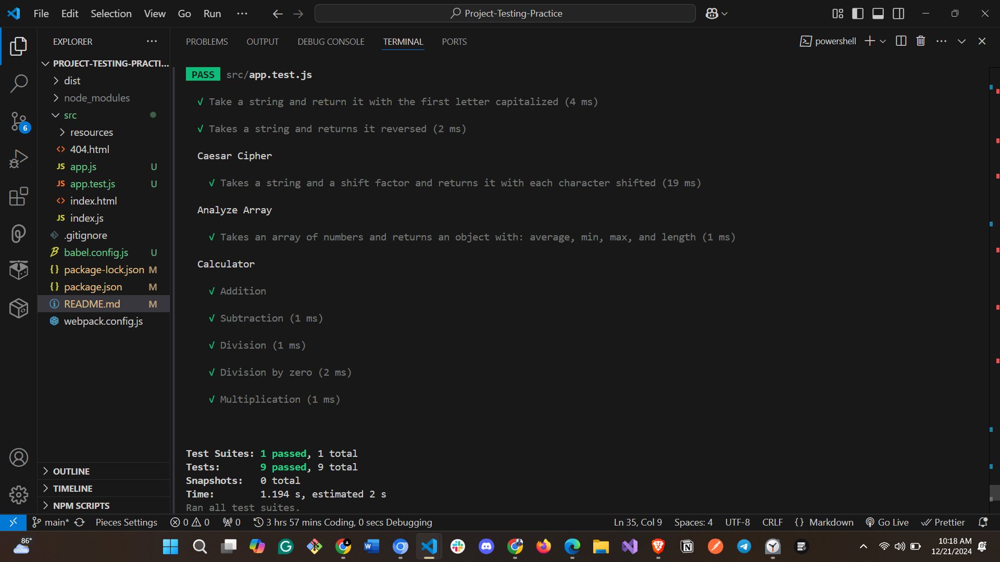

# JavaScript Testing Practice

This project is a practice exercise focused on writing unit tests using Jest for common JavaScript functions and operations. The goal is to demonstrate skills in Test-Driven Development (TDD) and writing tests for basic JavaScript functions.

## Features

- **`capitalize`**: Capitalizes the first letter of a string.
- **`reverseString`**: Reverses a given string.
- **`caesarCipher`**: Implements the Caesar cipher with shift functionality, preserving case and handling non-alphabet characters.
- **`analyzeArray`**: Analyzes an array of numbers and returns an object with `average`, `min`, `max`, and `length`.
- **`Calculator`**: A simple calculator that can perform addition, subtraction, multiplication, and division (with error handling for division by zero).

## Testing

The project uses **Jest** for unit testing. The following tests are implemented:

- Functionality tests for `capitalize`, `reverseString`, `caesarCipher`, and `analyzeArray`.
- Tests for basic calculator operations: addition, subtraction, multiplication, and division (with zero error handling).

## Installation

1. Clone this repository:

```
git clone https://github.com/john-walter-munene/Project-Testing-Practice
```

2. Install the required dependencies:
```
npm install
```

3. Run the tests:
```
npm test
```

### Test results (Image attached)
